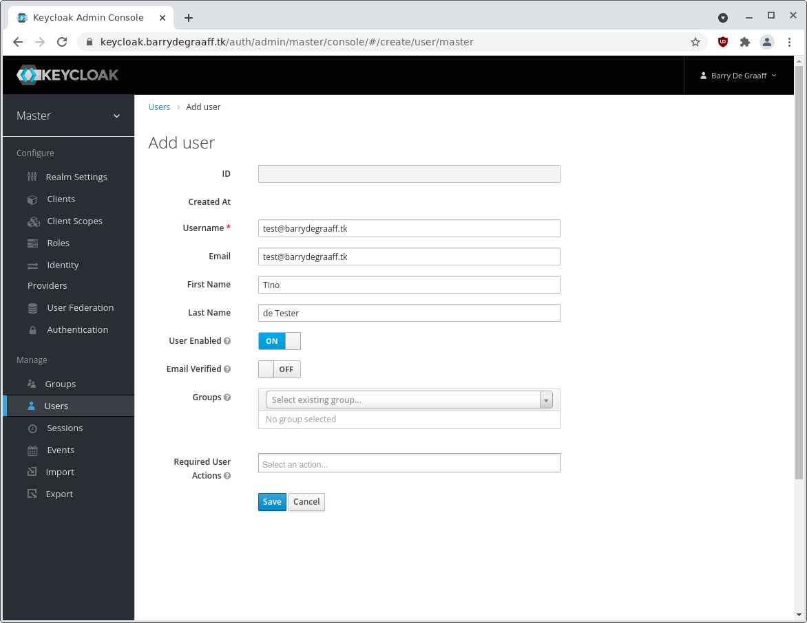

# Zimbra with on premise Single Sign-On using Keycloak

In this article you will learn how to install Keycloak and how to set-up Zimbra on Keycloak. Keycloak is an open source identity and access management solution developed by RedHat.

By using Keycloak you will be able to manage all your users from Keycloak and implement Single Sign-On. Keycloak offers SAML, OpenID,  social login, multi-factor authentication and more.

The technology used in this article is SAML, an open standard for Single Sign-On. When using SAML an Identity Provider (IdP) will take care of user authentication after which users can use their applications without having to log-on to each of them separately. In SAML these applications are called Service Providers (SP). 

Learning objectives:

- How-to Install Keycloak on Ubuntu 20. 
- Understand that Keycloak is a SAML IdP out of the box.
- Configuring Zimbra as a SAML SP on Keycloak. 


## Installing Keycloak

This article assumes you already installed Ubuntu and have a working DNS name pointing to your Keycloak server _and_ that you have valid TLS certificates. You will need properly configured https connections for SAML to work.

Download Keycloak and install it using the following commands as root:

```
apt-get update && apt upgrade -y
reboot
apt-get install default-jdk -y
cd /opt
wget https://github.com/keycloak/keycloak/releases/download/15.0.1/keycloak-15.0.1.tar.gz
tar -xvzf keycloak-15.0.1.tar.gz 
mv keycloak-15.0.1 /opt/keycloak
groupadd keycloak
useradd -r -g keycloak -d /opt/keycloak -s /sbin/nologin keycloak
chown -R keycloak: keycloak
chmod o+x /opt/keycloak/bin/
```

Next set-up Keycloak in SystemD using the commands:

```
cd /etc/
mkdir keycloak
cp /opt/keycloak/docs/contrib/scripts/systemd/wildfly.conf /etc/keycloak/keycloak.conf
cp /opt/keycloak/docs/contrib/scripts/systemd/launch.sh /opt/keycloak/bin/
chown keycloak: /opt/keycloak/bin/launch.sh
```
Open `launch.sh` using `nano` and update `WILDFLY_HOME`, the result should be:

```
cat /opt/keycloak/bin/launch.sh
#!/bin/bash

if [ "x$WILDFLY_HOME" = "x" ]; then
    WILDFLY_HOME="/opt/keycloak"
fi

if [[ "$1" == "domain" ]]; then
    $WILDFLY_HOME/bin/domain.sh -c $2 -b $3
else
    $WILDFLY_HOME/bin/standalone.sh -c $2 -b $3
fi
```

Creating a SystemD service file `/etc/systemd/system/keycloak.service` with the following content:

```
[Unit]
Description=The Keycloak Server
After=syslog.target network.target
Before=httpd.service

[Service]
Environment=LAUNCH_JBOSS_IN_BACKGROUND=1
EnvironmentFile=/etc/keycloak/keycloak.conf
User=keycloak
Group=keycloak
LimitNOFILE=102642
PIDFile=/var/run/keycloak/keycloak.pid
ExecStart=/opt/keycloak/bin/launch.sh $WILDFLY_MODE $WILDFLY_CONFIG $WILDFLY_BIND
StandardOutput=null

[Install]
WantedBy=multi-user.target
```

Optionally, you can copy a template service file and change that to above using:

```
cp /opt/keycloak/docs/contrib/scripts/systemd/wildfly.service /etc/systemd/system/keycloak.service
```
This is only useful if the service file get significant updates in the future and the copy paste from the above no longer works.

Finally load the changes and start Keycloak:

```
systemctl daemon-reload
systemctl enable keycloak
systemctl start keycloak
```
You can debug using `tail -f /opt/keycloak/standalone/log/server.log` and `systemctl status keycloak`

### Adding your first admin user to Keycloak

This can be done via the command line only as root as follows:

```
/opt/keycloak/bin/add-user-keycloak.sh -r master -u YOURADMINUSERNAMEHERE -p ARANDOMPASSWORDHERE
```
Restart Keycloak for adding the initial user:
```
systemctl restart keycloak
```

Go to your Keycloak server and log-in with the user you just created.


The Single Sign-On in this article uses the email address as the account name, this is easy but not practical if you want to support people changing their email address. 

If you want the Keycloak admin to be able to log-on to Zimbra as well, set the email address in the Keycloak Administration Console.


*Click your name in the right-top and click Manage account.*


*Click Personal info.*


*Update Email Address in Personal info.*

Make sure the email address you use exists in Zimbra, it will not be automatically created. 

To create an account on Zimbra via the command line, run as user `zimbra`:
```
zmprov ca user@barrydegraaff.tk RANDOMPASSWORDHERE
```

## Installing Nginx reverse proxy

To keep things simple we install an Nginx reverse proxy, this way you can add your own TLS certificates without having to change the Keycloak configuration. You can also use Apache instead of Nginx, see next section.

```
apt install nginx
```

Now replace `/etc/nginx/sites-enabled/default` with the following content:

```
# provided as an example, harden and configure as you see fit
# Upstreams
upstream backend {
    server 127.0.0.1:8443;
}

# HTTPS Server
server {
    listen 443;
    server_name keycloak.barrydegraaff.tk;

    # You can increase the limit if your need to.
    client_max_body_size 200M;

    error_log /var/log/nginx/keycloak.access.log;

    ssl on;
    ssl_certificate /etc/letsencrypt/live/barrydegraaff.tk/cert.pem;
    ssl_certificate_key /etc/letsencrypt/live/barrydegraaff.tk/privkey.pem;
    ssl_protocols TLSv1 TLSv1.1 TLSv1.2; # don’t use SSLv3 ref: POODLE

    location / {
        proxy_pass https://backend/;
        proxy_ssl_verify        off;
        proxy_http_version 1.1;
        proxy_hide_header 'X-Frame-Options';
        proxy_hide_header 'Access-Control-Allow-Origin';

        proxy_set_header Upgrade $http_upgrade;
        proxy_set_header Connection "upgrade";
        proxy_set_header Host $http_host;

        proxy_set_header X-Real-IP $remote_addr;
        proxy_set_header X-Forwarded-For $proxy_add_x_forwarded_for;
        proxy_set_header X-Forward-Proto http;
        proxy_set_header X-Nginx-Proxy true;

        proxy_redirect off;
    }
}
```

Update the paths to your TLS certificates in ssl_certificate and ssl_certificate_key and configure your server FQDN in server_name. Don't forget:

```
systemctl restart nginx
```

## Installing Apache reverse proxy

To keep things simple we install an Apache reverse proxy, this way you can add your own TLS certificates without having to change the Keycloak configuration. You can also use Nginx instead of Apache, see previous section.

```
apt install apache2
a2enmod proxy_http
a2enmod proxy
a2enmod ssl
a2enmod rewrite
a2enmod headers
```

Now put `/etc/apache2/sites-enabled/keycloak.conf` with the following content:

```
<VirtualHost *:443>
    SSLEngine on

    SSLCertificateFile /etc/letsencrypt/live/zimbra.tech/fullchain.pem
    SSLCertificateKeyFile /etc/letsencrypt/live/zimbra.tech/privkey.pem

    ServerName keycloak.zimbra.tech

    SSLProxyEngine on
    SSLProxyVerify none
    SSLProxyCheckPeerCN off
    SSLProxyCheckPeerName off
    SSLProxyCheckPeerExpire off
    ProxyPreserveHost On
    RewriteEngine On
    RewriteRule /(.*)           https://keycloak.zimbra.tech:8443/$1 [P,L]
    ProxyPassReverse /          https://keycloak.zimbra.tech:8443/

</VirtualHost>

```
Update the paths to your TLS certificates in ssl_certificate and ssl_certificate_key and configure your server FQDN in server_name. Don't forget:

```
systemctl restart apache2
```

## Configuring Zimbra in Keycloak

In Keycloak go to Administration Console -> Client and click the Create button on the right top.


*Keycloak Clients list.*

In the Add Client wizard add the following information and click Save.

| Field | Value |
|---|---|
| Client ID | https://zm-zimbra9.barrydegraaff.tk/service/extension/samlreceiver |
| Client Protocol | saml |
| Client SAML Endpoint | https://zm-zimbra9.barrydegraaff.tk/service/extension/samlreceiver |


*Add Client step 1.*

On the newly created client you will have to set the following:

| Field | Value |
|---|---|
| Client ID | https://zm-zimbra9.barrydegraaff.tk/service/extension/samlreceiver |
| Name | zimbra |
| Enabled | on |
| Client Protocol | saml |
| Include AuthnStatement | on |
| Force Artifact Binding | off |
| Sign Documents | on |
| Optimize REDIRECT signing key lookup | off |
| Sign Assertions | off |
| Encrypt Assertions | off |
| Client Signature Required | off (if you do not use SLO you can leave it ON) |
| Force POST Binding | off |
| Front Channel Logout | on |
| Force Name ID Format | on |
| Name ID Format | email |
| Valid Redirect URIs | https://zm-zimbra9.barrydegraaff.tk/service/extension/samlreceiver |
|  | https://zm-zimbra9.barrydegraaff.tk/service/extension/samlslo |
| Master SAML Processing URL | https://zm-zimbra9.barrydegraaff.tk/service/extension/samlreceiver |
| IDP Initiated SSO URL Name | zimbra |
| Logout Service POST Binding URL | empty |
| Assertion Consumer Service POST Binding URL | https://zm-zimbra9.barrydegraaff.tk/service/extension/samlreceiver |
| Logout Service Redirect Binding URL | https://zm-zimbra9.barrydegraaff.tk/service/extension/samlslo |

The /samlslo endpoint only works via a redirect from the user's browser. HTTP-Redirect protocol binding with Front Channel Logout.


The following screenshots show all fields as they are in the UI:


Setting the `IDP Initiated SSO URL Name` will enable a URL that you can use to test the Zimbra login. It looks like this:

https://keycloak.barrydegraaff.tk/auth/realms/master/protocol/saml/clients/zimbra

Don't forget to hit Save button at the bottom of the page.

## Set up Zimbra

Download from Keycloak the IDP public certificate from the SAML IDP descriptor XML file. You can find this via https://keycloak.barrydegraaff.tk/auth/realms/master/protocol/saml/descriptor `master` is the default name of your realm. If you have a different realm name, you should update the url. 

You can also find the SAML descriptor in the UI navigate to Administration Console ->  Realm Settings -> SAML 2.0 Identity Provider Metadata.


*Keycloak IDP Meta Data.*

Once you see the SAML IDP descriptor XML file copy the value of the ds:X509Certificate. Make sure to select the whole certificate by scrolling all the way to the right.


*Copy IDP Certificate.*

Convert the X509Certificate using  https://www.samltool.com/format_x509cert.php


*Convert IDP Certificate.*

Store the result on your Zimbra server in `/tmp/idpcert.pem` the contents should look like:

```
root@zm-zimbra9:~# cat /tmp/idpcert.pem
-----BEGIN CERTIFICATE-----
MIICmzCCAYMCBgF7Pn97RjANBgkqhkiG9w0BAQsFADARMQ8wDQYDVQQDDAZtYXN0
ZXIwHhcNMjEwODEzMDc1MDQ3WhcNMzEwODEzMDc1MjI3WjARMQ8wDQYDVQQDDAZt
YXN0ZXIwggEiMA0GCSqGSIb3DQEBAQUAA4IBDwAwggEKAoIBAQCy25QdSejDms4c
iwXywlMNMknS0ziJxj3pOcqB0A+F+B1rZMMay6F/Kqoq6dYoTCefjM41WfZUAS6R
/giZkYTPGRa5RFOtTMvGCLiweoyPzKHs1WxeSX09Q4ivINK+esoPmL6YqAZrSCq2
hhzajlu0El+aFQEPsOYc1mkgg61N5JvUETFSrWEDyPSeh/Mva/OZ9Uhi1oivKoGV
9rSfmyjZV02jfFUoo/aKZuzyIgza7+kA2j6nbBpBnQm/yiLfNau0Fxn7wYgV0N5K
CeNup+CYbEdrikENaH76LU3U0duk1ONvziwBMd8ArVMoNPoH8w6+ttfGIexZ/RU5
aguXE4ipAgMBAAEwDQYJKoZIhvcNAQELBQADggEBALDZvA8L3Ff/xwtrALkpx8jl
9oMrlVl5p06isXTSjoZT3m8jj1z7sv3VLKbAwKxml9QxyPlgg18d0Rf6PpET2iDa
lFueQRgVhTJoX7SE2d/Kfkt+otIMYuddoKD0gDgRgAWM3hWdldwV5IiFnjAC98XA
cMOOFyX2qr3UOhiv5e/e/ytGaKP+aiJXKMwAmgPkg8vd+mgXKIh536vYRAd3OMyH
336zV0rs3XCl2bRZ8Lcn7eA4ssIj6ByTioEWPulFHHOEG8RYXsl2vmfkKGRhYcKP
/iAXM39eisOui1wcKESfpo4wIRFk4KXGdd4j5Ez3sMsPBmV3X6ncQKMBMRgAJ4o=
-----END CERTIFICATE-----
```

Add the file `/opt/zimbra/conf/saml/saml-config.properties` to configure SAML in Zimbra add the contents:

```
# Issuer
saml_sp_entity_id=https://zm-zimbra9.barrydegraaff.tk/service/extension/samlreceiver
# Login receiver for the service provider
saml_acs=https://zm-zimbra9.barrydegraaff.tk/service/extension/samlreceiver
# Name ID format for the IDP to use in the SAMLResponse
saml_name_id_format=urn:oasis:names:tc:SAML:1.1:nameid-format:emailAddress
# Date format for issue instant
saml_date_format_instant=yyyy-MM-dd'T'HH:mm:ss'Z'
# Identity provider login endpoint for redirect method
saml_redirect_login_destination=https://keycloak.barrydegraaff.tk/auth/realms/master/protocol/saml
# Identity provider login endpoint for POST method
saml_post_login_destination=https://keycloak.barrydegraaff.tk/auth/realms/master/protocol/saml
# Identity provider logout endpoint for redirect method
saml_redirect_logout_destination=https://keycloak.barrydegraaff.tk/auth/realms/master/protocol/saml
# Identity provider logout endpoint for POST method
saml_post_logout_destination=https://keycloak.barrydegraaff.tk/auth/realms/master/protocol/saml
# Logout redirect page if we are the landing page logout endpoint
saml_landing_logout_redirect_url=/
# Disable the audience path check
saml_skip_audience_restriction=true
# URL to send the user with error_code, error_msg query params. Default results in HTTP error code pages.
saml_error_redirect_url=
# The SAML logout document encoding, and SAML login receiver parameter encoding.
saml_document_encoding=ASCII
# Set to true to disable the audience path check.
saml_skip_audience_restriction=false
# The redirect location to send the user if their Zimbra account is not active.
saml_inactive_account_redirect_url
# The redirect location to send the user if webclient login for their Zimbra account is disabled.
saml_webclient_disabled_account_redirect_url
```

From the command line as user root copy the samlextn.jar and set up the IDP certificate like this:

    mkdir /opt/zimbra/lib/ext/saml
    cp /opt/zimbra/extensions-network-extra/saml/samlextn.jar /opt/zimbra/lib/ext/saml/
    su zimbra
    cat /tmp/idpcert.pem |xargs -0 zmprov md barrydegraaff.tk zimbraMyoneloginSamlSigningCert
    # zmprov mcf zimbraCsrfRefererCheckEnabled FALSE
    zmprov mcf zimbraCsrfAllowedRefererHosts keycloak.barrydegraaff.tk
    zmmailboxdctl restart

### Single logout

If you want the IDP to log-out all applications when the user clicks logout in Zimbra you have to configure Zimbra to use this log-out url:

```
zmprov md barrydegraaff.tk zimbraWebClientLogoutURL https://zm-zimbra9.barrydegraaff.tk/service/extension/samllogout
#or globally
zmprov mcf zimbraWebClientLogoutURL https://zm-zimbra9.barrydegraaff.tk/service/extension/samllogout
```

### Create users

Your user accounts must be manually created in Zimbra and be available in your IDP user database. It is important that the E-mail attribute in your IDP is set exactly the same as the Zimbra account name. Or the user will not be able to log-in. If it does not work run a `tail -f /opt/zimbra/log/*` while doing the authentication request and dig through to log to find out what the issue may be. Keywords to grep for: SAML, Audience and assertion.

### Configurable Properties saml-config.properties

The samlextn.jar uses a property file located at: `${zimbra_home}/conf/saml/saml-config.properties`.

The following properties are supported:

| Key | Description | Default | Optional |
| --- | ----------- | ------- | -------- |
| saml_sp_entity_id | Issuer | | |
| saml_acs | Login receiver for the service provider | | |
| saml_redirect_login_destination | Identity provider login endpoint for redirect method | | |
| saml_redirect_logout_destination | Identity provider logout endpoint for redirect method | | |
| saml_post_login_destination | Identity provider login endpoint for POST method (unused) | | √ |
| saml_post_logout_destination | Identity provider logout endpoint for POST method (unused) | | √ |
| saml_name_id_format | Name ID format for the IDP to use in the SAMLResponse | `urn:oasis:names:tc:SAML:1.1:nameid-format:unspecified` | √ |
| saml_date_format_instant | Date format for issue instant | `yyyy-MM-dd'T'HH:mm:ss'Z'` | √ |
| saml_error_redirect_url | URL to send the user with `error_code`, `error_msg` query params. Default results in HTTP error code pages. | | √ |
| saml_landing_logout_redirect_url | Logout redirect landing page if we are the last logout service. | `/` | √ |
| saml_document_encoding | The SAML logout document encoding, and SAML login receiver parameter encoding. | `ASCII` | √ |
| saml_skip_audience_restriction | Set to true to disable the audience path check. | `false` | √ |
| saml_inactive_account_redirect_url | The redirect location to send the user if their Zimbra account is not active. | `/service/extension/samllogout` | √ |

Now you are ready to log-on to Zimbra using SAML. Try a fresh browser/incognito window and go to: https://keycloak.barrydegraaff.tk/auth/realms/master/protocol/saml/clients/zimbra


If all goes well, you should now be logged-on to Zimbra. You can change the default log-in page for Zimbra using
    
    zmprov md barrydegraaff.tk zimbraWebClientLoginURL https://keycloak.barrydegraaff.tk/auth/realms/master/protocol/saml/clients/zimbra

### Debugging

If you are having issues you can tail the logs on Zimbra and Keycloak while doing a log-in.

On Zimbra:

```
tail -f /opt/zimbra/log/mailbox.log
```

On Keycloak:

```
tail -f /opt/keycloak/standalone/log/server.log
```

## Adding more users

This can be done in Keycloak by going to Administration Console -> Users and click Add user button.




You can now find and open the user in Keycloak by going to Administration Console -> Users. Click edit:


Go to the Credentials tab to set-up the password.


test@barrydegraaff.tk is now ready on Keycloak. You will also need to add the user on Zimbra in the Admin Console -> Manage -> Accounts:


You can now test this log-in by using a fresh browser/incognito window and go to: https://keycloak.barrydegraaff.tk/auth/realms/master/protocol/saml/clients/zimbra

## Manage user accounts from Zimbra

You can also set-up Keycloak to use Zimbra LDAP to authenticate your users, this way you will do all user management on Zimbra and leverage the SSO capabilities of Keycloak. You can set this up in Administration Console -> User Federation and select LDAP:


You can find your LDAP bind credentials by running the following commands as user `zimbra` on your Zimbra server:

```
source ~/bin/zmshutil 
zmsetvars 
echo $zimbra_ldap_password
echo $zimbra_ldap_userdn
ldapsearch -x -H $ldap_master_url -D $zimbra_ldap_userdn -w $zimbra_ldap_password "mail=*"
```
The `ldapsearch` command will allow you to find your base DN as well. Usually something like `ou=people,dc=example,dc=com`.

## zimbraAuthFallbackToLocal

If you have tested Single Sign-On authentication and it works, you may want to disable Zimbra set passwords by issuing:

```
zmprov md barrydegraaff.tk zimbraAuthFallbackToLocal FALSE
#or disable Zimbra set passwords globally
zmprov mcf zimbraAuthFallbackToLocal FALSE
```

Please note that admin accounts in Zimbra always have the ability to use the password set on Zimbra, so it is suggested you set a complex password and do not use Zimbra admin accounts for daily activities.

## zimbraWebClientLoginURL

Once you disable zimbraAuthFallbackToLocal the Zimbra log-in page will no longer work, and you probably want to redirect users to use the Keycloak login page like this:

```
zmprov md barrydegraaff.tk zimbraWebClientLoginURL https://keycloak.barrydegraaff.tk/auth/realms/master/protocol/saml/clients/zimbra
#or globally
zmprov mcf zimbraWebClientLoginURL https://keycloak.barrydegraaff.tk/auth/realms/master/protocol/saml/clients/zimbra
```

## References

- https://medium.com/@hasnat.saeed/setup-keycloak-server-on-ubuntu-18-04-ed8c7c79a2d9
- https://www.samltool.com/format_x509cert.php
